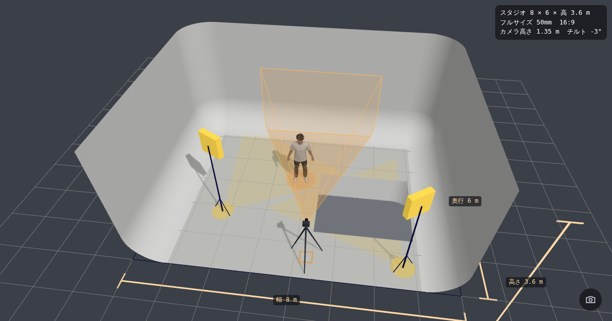

# Studio Planner

スタジオ撮影の準備と打合せのための 3D Web アプリ。ブラウザだけで動き、
スマホとタブレットでも操作できる。インストールもログインも不要。無料。

**→ https://mojon1.github.io/Studio-Planner/**

CG スタッフではなく、プロダクションマネージャー・カメラマン・照明チーム・
ディレクターが、現場で 30 秒で答えを得るための道具として作っている。



- 開発用プレビュー（人物モデルは出ません）: https://claude.ai/code/artifact/85c9a190-9e05-4b34-b66b-d4692507d6f9

## できること

| 分類 | 内容 |
|---|---|
| スタジオ | 幅・奥行・高さの入力、プリセット 4 種、ホリゾント（R 壁）を奥・左・右で個別に指定 |
| 人 | デッサン人形タイプのマネキン。男性 / 女性 / 男の子 / 女の子。頭身は身長から自動 |
| 人物モデル | 実写風の人物 11 体（アジア系・アフリカ系・欧米系 × スーツ・カジュアル × 男女）。`+` から顔で選ぶ。身長スライダーに追従 |
| ポーズ | 立つ 3・座る 2・寝る 2 の 7 種。人物の設定パネルの一番下からサムネイルで選ぶ |
| 小道具 | 車（セダン・ワゴン・バン・軽）、椅子、テーブル、箱。すべて寸法可変。箱馬は 300×450×150 mm 固定で、平・横・縦に置き分け |
| 撮影機材 | カメラ（複数可・見ている 1 台を切替）、ライト、ミラー（床鏡・立て鏡）、背景布（色自由） |
| 取り込み | GLB / FBX。ドラッグ&ドロップ対応。単位の自動判定と横倒し補正つき |
| ビュー | 上面 / 側面 / 正面 / パース / カメラ全画面。カメラ窓は移動とサイズ変更ができる。グリッドと寸法は個別に消せる |
| カメラ | 高さ・パン・チルト・ロール。センサーはフォーマット選択（スーパー35・フルサイズ・MFT・手動）、焦点距離、比率。チルトは図面上の弧でも動かせる |
| 編集 | ドラッグで移動、リングで回転。右クリック（スマホは長押し）で削除・複製・ロック。背景布と鏡は辺をつまんで大きさ変更 |
| リスト | 表示の切替、ロック、削除、つまみを掴んで並べ替え。名前は右クリックから変更 |
| 共有 | 配置を URL に圧縮して埋め込む。サーバー不要。図面とカメラ絵を PNG 書き出し |
| 保存 | 配置をファイルに「名前をつけて保存」。案件名とカットから名前が付く。読み込みも同じ場所 |
| PDF | A4 一枚に上面・側面・パース・ファインダーの 4 面とカメラ情報。案件名・カット・出力日時・メモ入り。A4 横／縦を選択 |

## 保存と共有の使い分け

| したいこと | 使うもの |
|---|---|
| いま画面を見せたい・チャットに貼りたい | 「リンクをコピー」 |
| 来月また開きたい・PC を移したい | 「保存」（名前と場所を選べます） |
| 相手に触らせたくない | 「見るだけリンク」 |

取り込んだ 3D モデルの実体はその端末の中だけに残る。リンクにもファイルにも
名前と実寸しか入らないので、別の PC で開くと実寸の箱として出る。

## PDF の作り方

「共有」タブで案件名とカットとメモを入れ、用紙の向きを選んで「PDF保存」。
表示された用紙を確認してから「PDF にする」を押し、ブラウザの印刷画面で
送信先を「PDF に保存」にする。上面・側面・パースの 3 面はドラッグで動かし、
ホイールで拡大縮小できる。ファインダーだけは動かせない。カメラが実際に撮る
画角とずれた絵を配ることになるため、意図的に固定してある。

日本語を確実に出すためにブラウザの印刷機能を使っている。jsPDF などで直接
書き出す場合、CJK フォントを数 MB 埋め込む必要があり、単一 HTML の構成と合わない。

## 動かし方

**`file://` で直接開くと動きません。** ES モジュールと importmap を使っているため、
必ず HTTP で配信すること。

```
python -m http.server 8000
```

ブラウザで `http://localhost:8000/` を開く。Node があるなら `npx serve` でもよい。

## 公開の仕方

`main` に push すると GitHub Actions が GitHub Pages へ出す。ビルドは無い。

```
https://mojon1.github.io/Studio-Planner/
```

**最初の 1 回だけ手作業がいる。** リポジトリの Settings → Pages →
Build and deployment → Source を「**GitHub Actions**」にする。
GITHUB_TOKEN には Pages サイトを新規作成する権限が無いため、ここは自動化できない。
入れたら Actions タブの「Deploy to GitHub Pages」を Re-run。以降は push で出る。

出すのは `index.html` / `models/` / `ogp.png` / `README.md` だけ。
`test/` `tools/` `docs/` `CLAUDE.md` は除いてある。

帯域が足りなくなったり独自ドメインを付けたくなったら Cloudflare Pages に
移せる（このリポジトリを繋ぐだけ。無料枠は帯域無制限、1 ファイル 25 MiB まで）。

### OGP 画像

リンクを貼ったときのサムネイルは `ogp.png`。アプリ自身をヘッドレスで撮っている。

```
cd test && npm install
PW_CHROME=<chromium> node ../tools/make-ogp.mjs
```

UI を変えたら撮り直す。`index.html` の `og:image` は絶対 URL なので、
独自ドメインに移すときはそこも直す。

## テスト

`test/` にヘッドレスブラウザでの動作確認スクリプトがある。

```
cd test
npm install
node run.mjs
```

スクリーンショットが `test/out/` に出る。JS エラーの有無、共有リンクの往復、
モデル取り込みの寸法、センサー換算値などを確認できる。

## 技術的なメモ

- three.js r170 を jsDelivr から importmap で読み込む。ビルドツールは使わない。
- 人物モデルは `models/` の GLB。「人物」に切り替えたときだけ取りに行くので、
  使わない人は 1 バイトも払わない。**`file://` や claude.ai のプレビュー枠では
  取りに行けず、マネキンのままになる。**
- 取り込んだ 3D モデルの実体は IndexedDB にその端末だけで保存する。
  共有リンクには名前・実寸・位置だけが入り、相手の画面では実寸の箱になる。
- DRACO / KTX2 で圧縮した glTF は、デコーダを実行時に外部から取りに行くため
  Artifact の通信制限下では読めない。自前のサーバーに置けば動く。非圧縮の GLB 推奨。
- カメラ窓の位置とサイズ、設定パネルの開閉、保存したセンサー幅は localStorage に入る。

## ライセンス

コードは MIT。`models/` の 3D モデルは対象外で、著作権は寺村太一に帰属する。
詳細は [LICENSE](LICENSE)。
